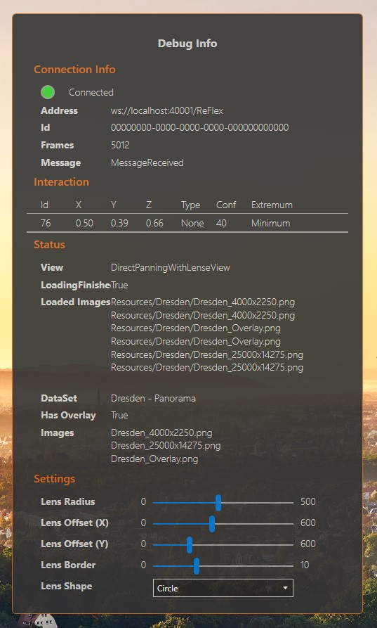
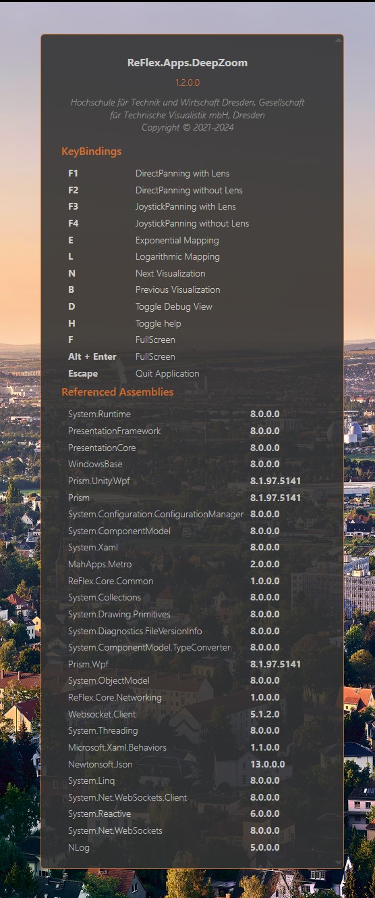

# ReFlex DeepZoom


<!-- omit in toc -->

## Table of contents

1. [Table of contents](#table-of-contents)
2. [Introduction](#introduction)
3. [System Requirements](#system-requirements)
4. [Keyboard Shortcuts](#keyboard-shortcuts)
5. [Custom Datasets](#custom-datasets)
6. [Maximum image size](#maximum-image-size)
7. [Overlay](#overlay)
8. [Debug / Settings Panel](#debug--settings-panel)
9. [Info Panel](#info-panel)
10. [Loading Screen](#loading-screen)


## Introduction

**ReFlex DeepZoom** is a .NET/WPF application demonstrating interaction concepts for _Elastic Displays_ for GigaPixel zoom images using the [ReFlex Framework](https://github.com/visualengineers/reflex)

## System Requirements

* OS: Windows 10
* .NET Core 8.0
* 16 GB of RAM

## Keyboard Shortcuts

| Key      | Action                                          |
| -------- | ----------------------------------------------- |
| `F1`     | Program Mode: Zooming using an interactive lens |
| `F2`     | Program Mode: Full-Screen Zoom                  |
| `N`      | Load Next Dataset                               |
| `B`      | Load Previous Dataset                           |
| `D`      | Toggle Debug Panel                              |
| `H`      | Toggle Info Panel                               |
| `F`      | Toggle Fullscreen                               |
| `Escape` | Quit Application                                |

## Custom Datasets

Images are places in subfolders inside the `src/Resources/` directory.
A dataset contains:

* a preview image in full HD resolution (1920x1080)
* a full sized image with a higher reolution (limits: see [maximum image size](#maximum-image-size))
* (optional) an overlay image that is displayed in the lens/when as data layer blended over the data layer (see [overlay](#overlay))

So far, only `png` files have been tested as image format.

Datasets are specified in the `data.json` file placed in `src/Resources`

The format for a dataset looks as follows:

```json

    {
      "name": "My Panorama",                    // title displayed when loading the image
      "basePath": "Resources/PanoFolder",       // folder for the images
      "imageFullPath": "full_size_image.png", 
      "imagePreviewPath": "1080p_image.png",
      "imageOverlayPath": "overlay_image.png",  // can be omitted
      "isActive": false,                        // only active data sets can be loaded in the application
      "hasOverlay": true                        // specify if there is an overlay to display
    },

```

## Maximum image size

in the current implementation, all image data is loaded into a byte array by using `Windows.Media.Imaging.BitmapSource`. For byte one-dimensional byte arrays there is a size limitation in.NET (regardless of using x64 a Platform Target or specifying `gcAllowVeryLargeObjects` in `app.config`)

The max size if a byte array, according to the [Microsoft .NET documentation](https://learn.microsoft.com/en-us/dotnet/framework/configure-apps/file-schema/runtime/gcallowverylargeobjects-element#remarks) is `2.147.483.591` bytes.

This translates to the following maximum image dimensions (assuming an aspect ratio of 16:9):

| Format | Bit Depth | Width    | Height   |
| ------ | --------- | -------- | -------- |
| RGBA   | 32 Bit    | 30893 px | 17377 px |
| RGB    | 24 Bit    | 35673 px | 20066 px |

## Overlay

The template file for creating overlays is placed in the `Design` subfolder.

For creating the overlay, the gigapixel image is place as backgroudn image. for performance reasons, a reduced resolution of 12000px x 8750px is used.

The overlay can be of any size as it is stretched to fit the full size image

## Debug / Settings Panel



## Info Panel



## Loading Screen

